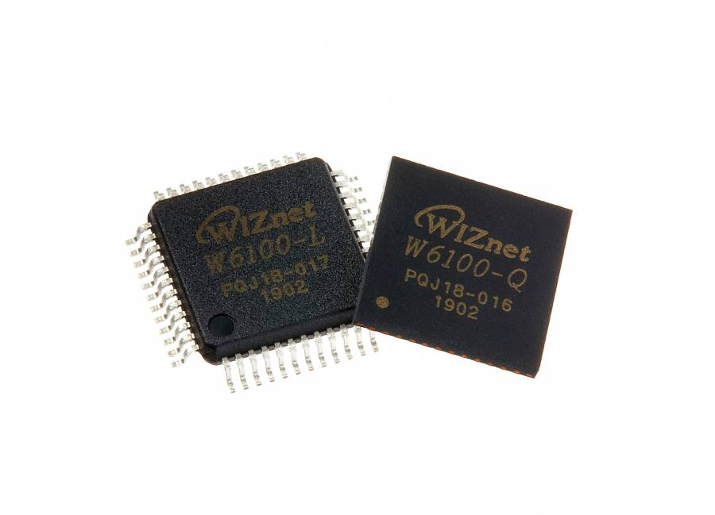

## W6100

test

test2

test3

test4

-----

## Chip

  - **[Chip Overview](/products/w6100/overview/start)**
      - Features
      - Target Applications

## Documents

  - **[Datasheet](/products/w6100/datasheet/start)**
      - Download Datasheet : Kr, Eng

## Schematic

  - **[Reference Schematic](/products/w6100/refschematic)**
      - External Transformer Type
      - RJ45 with Transformer Type
  - **[W6100-EVB](https://github.com/Wiznet/Hardware-Files-of-WIZnet/tree/master/02_iEthernet/W6100)**
      - Schematic(PDF)
      - Schematic(Altium)
      - Partlist
      - Gerber

## Related EVB

  - **[Description of W6100-EVB](/products/w6100/w6100_evb/start)**
      - Features
      - BASIC Project - TCP/UDP Loopback
      - Getting Started
      - Technical Reference

## Application Notes

 \</WRAP\>
